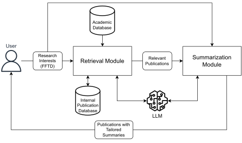
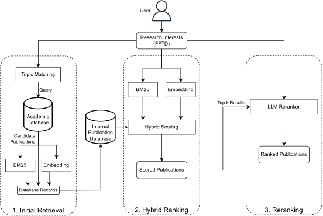
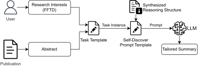

# Paper Recommendation & Summarization

---

Developed during my master's thesis at TU Berlin, this library provides an end-to-end RAG pipeline for paper
recommendation and summarization.
Its purpose is to assist researchers in staying up-to-date with the latest research in their field. As such, it is
focused on the discovery of new research, using [OpenAlex](https://openalex.org/) as a data source.

From a free-form text description (FFTD) of a research interest, the system retrieves a set of candidate papers from
OpenAlex, ranks them with regard to the query, and generates summaries tailored to the user's interest.

## Architecture

### Overview



### Retrieval



### Summarization



## Usage

```python
from datetime import datetime

from core import retrieval, summarization

query = "My research investigates the impact of climate change on coral reef degradation ..."
start_date = datetime(2025, 1, 1)

topics, added = retrieval.ingest(query, start_date, limit=2000, num_topics=10)  # build the corpus
works = retrieval.search(query, n=5, start_date=start_date)  # hybrid search + setwise LLM reranking
summaries = summarization.summarize(query, works[:3])  # summaries tailored to the query
```

The docker image provides an execution environment for this library. For more examples,
see [usage_example.ipynb](usage_example.ipynb), [scripts/smoke_test.py](scripts/smoke_test.py) and
[scripts/trace_run.py](scripts/trace_run.py), which records every pipeline stage (timings, tokens, cost, intermediate
results) as a replayable event stream (`core/instrumentation.py`).

### Code structure

```
core/
  __init__.py                   retrieval and summarization, created on first use (create_services)
  config.py                     settings from environment variables: database, API keys, models
  services/retrieval_service.py ingest (topics -> fetch -> filter -> embed -> index), search (semantic + BM25 ->
                                hybrid -> rerank)
  services/setwise_reranker.py  setwise heapsort LLM reranking, with concurrent comparisons
  services/summarization_service.py  tailored summaries
  services/deduplication.py     skips duplicate and junk works at ingest
  llm_interfaces/               OpenAI embeddings and chat completions (tokens and cost per call), prompts (tasks.py)
  repositories/                 SQL: vector and BM25 search, storage
  openalex.py                   OpenAlex API access
  works.py, sqlalchemy_models.py  the pipeline's work objects, the database tables
  instrumentation.py            Trace: per-stage timings, tokens, cost and events
scripts/                        smoke test, traced demo runs, pre-ingest of the demo queries, schema export
setup/                          database image, schema, OpenAlex topic embeddings
notebooks/                      thesis experiments and evaluation, written against earlier versions of core (thesis-era
                                code: commit 796e20c)
```

## Setup

### Prerequisites
- PostgreSQL instance
    - with [pgvector](https://github.com/pgvector/pgvector) (tested with 0.7.2 and 0.8.0)
    - with [pg_bestmatch_rs](https://github.com/tensorchord/pg_bestmatch.rs) (for BM25, tested with 0.0.1)
- Docker with Docker Compose, or [uv](https://docs.astral.sh/uv/) to run it locally
- OpenAI API key

### Preparing the Database
1. Setup the database schema via `setup/ddl.sql`.\
   E.g. `psql -U [DB_USER] -d [DB_NAME] -f setup/ddl.sql`
2. Load OpenAlex embeddings for topic matching via `setup/openalex_embeddings.sql`.\
   E.g. `psql -U [DB_USER] -d [DB_NAME] -f setup/openalex_embeddings.sql`

A database created before duplicate detection was added needs a one-off migration, which also removes the duplicates
and junk abstracts already stored: `uv run --env-file .env scripts/dedupe_publications.py [--dry-run]`.

### Setup Instructions
1. Copy `.env.example` to `.env` and fill in the required values (database connection parameters, OpenAI API key, etc).
2. Create the shared Docker network via `docker network create postgres_network`. The compose file uses it as an
   external network, so that other containers can reach the database as well.
3. Run `docker compose build` to obtain an image with the required dependencies.

Without Docker: `uv sync` creates `.venv` with the locked dependencies (`uv.lock`) and installs this project in editable
mode. `uv run --env-file .env <script>` then runs a script with the environment from `.env`, e.g.
`uv run --env-file .env scripts/trace_run.py rag_hallucinations --summaries 3`, which prints time, tokens and cost per
pipeline stage.

### Testing the Setup
You can test the setup by running\
`docker compose run --rm app python scripts/smoke_test.py 'llm rerankers'`\
or, without Docker, `uv run --env-file .env scripts/smoke_test.py 'llm rerankers'`

This script tests all components of the system, including the database connection, database extensions, OpenAI and
OpenAlex APIs, and the reranking model.

This will use `llm rerankers` as the research interest description (FFTD), perform topic matching and retrieve a small
number (100) of candidate papers from OpenAlex.
These papers will be stored in the database and then ranked w.r.t the FFTD using a hybrid ranking model (embedding +
BM25). After reranking via *[setwise.heapsort](https://arxiv.org/abs/2310.09497v2)*, the top 5 results are printed. The top 3 are then summarized, and the
summaries are printed.

The unit tests need neither API keys nor a database: `uv run python -m unittest discover -s tests -t .`\
Lint and format: `uv run ruff check` and `uv run ruff format`.
